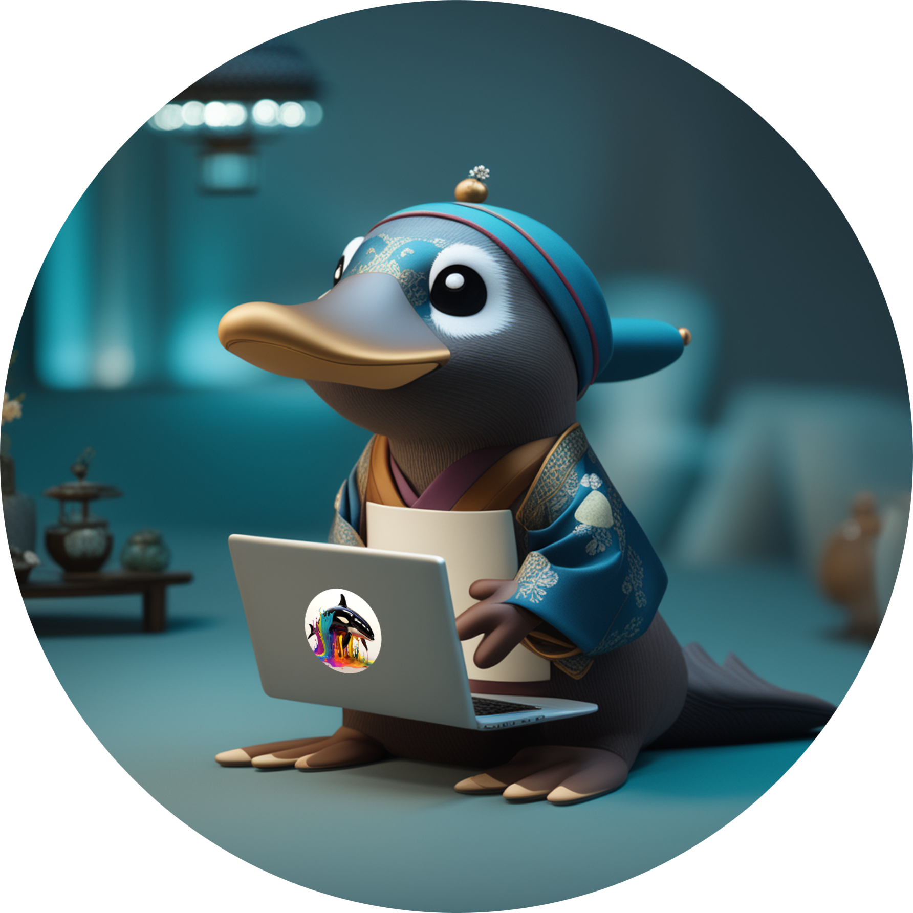

# 🐳Korean-OpenOrca🐳

<div align='center'>
<strong>Korean-Open-platypus 데이터셋을 활용하여 llama-2-ko를 fine-tuning한 Korean-Platypus model</strong> 
<br></br>

**🐳KoR-Orca-Platypus-13B🥮:** [](https://huggingface.co/kyujinpy/KoR-Orca-Platypus-13B)   
**🐳Korean-OpenOrca-13B:** [](https://huggingface.co/kyujinpy/Korean-OpenOrca-13B)  
   
**🐳OpenOrca-KO:** [](https://huggingface.co/datasets/kyujinpy/OpenOrca-KO)    
**🐳KOR-OpenOrca-Platypus:** [](https://huggingface.co/datasets/kyujinpy/KOR-OpenOrca-Platypus)    
본 연구는 (주)마커와 (주)미디어그룹사람과숲의 오픈소스 LLM 연구 컨소시엄에서 진행되었습니다.

---
</div>

# Model BenchMark(KO-LLM; will update new version)  
| Model | Average | Ko-ARC | Ko-HellaSwag | Ko-MMLU | Ko-TruthfulQA | Ko-CommonGen V2 | Dataset | Base_model |  
| --- | --- | --- | --- | --- | --- | --- | --- | --- |  
| [🐳KoR-Orca-Platypus-13B](https://huggingface.co/kyujinpy/KoR-Orca-Platypus-13B) | 50.13 | 42.06 | 53.95 | 42.28 | 43.55 | 68.78 | [KOR-OpenOrca-Platypus](https://huggingface.co/datasets/kyujinpy/KOR-OpenOrca-Platypus) | ko-en-llama2-13b |  
| [🐳Korean-OpenOrca-13B](https://huggingface.co/kyujinpy/Korean-OpenOrca-13B) | 47.85 | 43.09 | 54.13 | 40.24 | 45.22 | 56.57 | [🐳OpenOrca-KO](https://huggingface.co/kyujinpy/Korean-OpenOrca-13B) | ko-en-llama2-13b |  
| [KoT-Platypus2-13B](https://huggingface.co/kyujinpy/KoT-platypus2-13B) | 49.55 | 43.69 | 53.05 | 42.29 | 43.34 | 65.38 | [KoCoT](https://huggingface.co/datasets/kyujinpy/KoCoT_2000) | KO-platypus2-13B | 
| [KO-platypus2-13B](https://huggingface.co/kyujinpy/KO-Platypus2-13B) | 47.90 | 44.20 | 54.31 | 42.47 | 44.41 | 54.11 | [KOpen-platyus](https://huggingface.co/datasets/kyujinpy/KOpen-platypus) | ko-en-llama2-13b |  
  

# News
- 2023.10.14
   - Llama2-13B를 KOR-Orca-Platypus 데이터셋을 활용하여 fine-tuning한 [🐳KoR-Orca-Platypus-13B](https://huggingface.co/kyujinpy/KoR-Orca-Platypus-13B) Model 제작 완료.
   - HuggingFace KO-LLM 리더보드 1등 달성.

- 2023.10.09
   - Llama2-13B를 OpenOrca-KO를 활용하여 fine-tuning한 [🐳Korean-OpenOrca-13B](https://huggingface.co/kyujinpy/Korean-OpenOrca-13B) Model 제작 완료.  
   - [HuggingFace KO-LLM 리더보드](https://huggingface.co/spaces/upstage/open-ko-llm-leaderboard) ~~5등~~(~~3등~~) 달성.

   
# Quick start
```python
### KO-Platypus
from transformers import AutoModelForCausalLM, AutoTokenizer
import torch

repo = "kyujinpy/Korean-OpenOrca-13B"
OpenOrca = AutoModelForCausalLM.from_pretrained(
        repo,
        return_dict=True,
        torch_dtype=torch.float16,
        device_map='auto'
)
OpenOrca_tokenizer = AutoTokenizer.from_pretrained(repo)

```

# Datasets
```python
from datasets import load_dataset

# dataset testing
dataset = load_dataset("kyujinpy/OpenOrca-KO") # But currently, private repo. Please wait!
```  
**🐳OpenOrca-KO:** [](https://huggingface.co/datasets/kyujinpy/OpenOrca-KO)    
> It is public state!
     
# References
[🐳OpenOrca](https://huggingface.co/datasets/Open-Orca/OpenOrca)  
[Kopen-Platypus🥮](https://huggingface.co/datasets/kyujinpy/KOpen-platypus)   
[🐳OpenOrca-KO](https://huggingface.co/datasets/kyujinpy/OpenOrca-KO)  
[Platypus](https://github.com/arielnlee/Platypus)  
[llama-2-ko](https://huggingface.co/beomi/llama-2-ko-7b)  
[ko-en-llama2](https://huggingface.co/hyunseoki/ko-en-llama2-13b)  
[🐳Korean-OpenOrca-13B](https://huggingface.co/kyujinpy/Korean-OpenOrca-13B)
  
# TODO
- [x] Make KOR-OpenOrca
- [x] Share huggingface repo
- [x] Combined platypus+OpenOrca datasets
- [x] Make KOR-OpenOrca-Platypus
- [x] Share evaluation results
- [x] Share datasets
